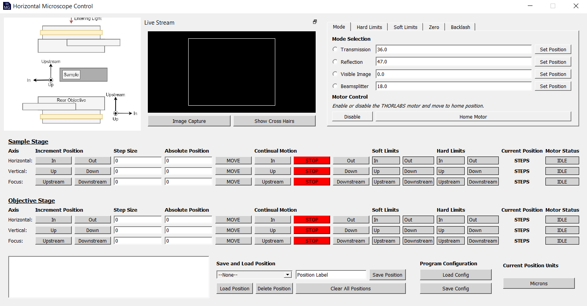

#  MicroGUI
The MicroGUI project is a user interface and hardware integration project for the FAR-IR beamline of the Canadian Light Source Inc.. The platform integrates with the facilities EPICS distributed control system, FLIR Blackfly camera and THORLABS motor stage to allow for remote control of the FAR-IR infrared horizontal microscope.


    
# Dependencies
This section will detail how to set up an environment that supports the operation of the MicroGUI software. More specifically, it will detail how to configure the Python environment, set up the THORLABS motor stage dependencies, and the FLIR/BlackFly camera dependencies.

## Python Environment
The Python setup contains various package imports that require installation. In some cases, these dependencies require specific Python versions (e.g. the FLIR PySpin dependency). Thus, it is recommended to use a virtual environment with a Python version of 3.8 to ensure compatibility. If anaconda is being used for virtual environments, the environment can be set up using the following commands:

```terminal
    conda create -n microgui python=3.8
    conda activate microgui
```

Once the python environment is set up, navigate [here](https://github.com/JaiWillems/MicroGUI) to download the repository containing all project files. These files will run the MicroGUI software.

To install the Python dependencies, open the terminal (ensure you have entered the microgui virtual environment) and navigate to the downloaded directory where the ```requirements.txt``` file is located. Run the following command:

```terminal
    pip install -r requirements.txt
```

This command will install the appropriate versions of the package dependencies to the current virtual environment that are necessary for operation of the MicroGUI software.

This concludes the Python environment setup.

## THORLABS Dependency Configuration
The horizontal microscope setup contains a THORLABS motor used for mode selection. This section details the steps to configure the THORLABS motor environment.

To begin, download and install the THORLABS APT software found [here](https://www.thorlabs.com/software_pages/ViewSoftwarePage.cfm?Code=Motion_Control&viewtab=1) that corresponds to your system architecture and Python version. This software is necessary for allowing the python modules to interface with the motors firmware.

Lastly, a small configuration of the *thorlabs_apt* Python library folder downloaded previously must occur to ensure proper dependencies are accessible. To accomplish this configuration, navigate the file system to find the *APT.dll* file from the THORLABS APT software and paste the file into the *thorlabs_apt* directory. Default installation will result in the *APT.dll* file being found in the following path, ```C:/Program Files/Thorlabs/APT/APT Server```.

This concludes the THORLABS motor environment setup.

## FLIR Dependency Configuration
To interface with the BlackFly USB3 camera, we will need to download and install two pieces of software: the Spinnaker SDK and the latest Python Spinnaker, both found [here](https://flir.app.boxcn.net/v/SpinnakerSDK). 

 ### Spinnaker SDK
Navigate the FLIR downloads directory into the appropriate operating system and download the ```Latest Spinnaker Full SDK``` file. Run the installation executable corresponding to your system architecture.

### Python Spinnaker
Navigate the FLIR downloads directory into the appropriate operating system and then into the *Latest Python Spinnaker* folder. Then download and unzip the latest Python Spinnaker (PySpin) folder that matches the installed Python version (for Python 3.8 on a Windows 64 machine. the appropriate folder is ```spinnaker_python-2.4.0.143-cp38-cp38-win_amd64.zip```).

The PySpin library can then be installed from the Python WHL file located in the just downloaded PySpin directory. To accomplish this, use the following commands in a terminal to navigate to the PySpin directory and install the WHL file:
    
```terminal
    cd <PySpin_whl_unzip_destination>
    pip install --user <PySpin_ehl_file>
```
    
This concludes the FLIR camera environment setup.


# Program Operation
At this point, all necessary dependencies are installed and we are ready to run the program.
    
Begin by **ensuring all THORLABS and FLIR/BlackFly software are closed** as their operations have been found to prevent access to external hardware from the MicroGUI software. Additionally, check that any other motor control programs for the horizontal microscope are closed, their presence can prevent the MicroGUI program from writing to process variables. Then, check the camera and THORLABS motors are connected to the computer (they will need to be connected before program initiation).
    
Navigate the terminal to the project repository (downloaded previously) and enter ```python main.py```. The program will take a moment to start up. Once the GUI has appeared, you will be ready to use the software to interface with the FAR-IR Horizontal Microscope.
